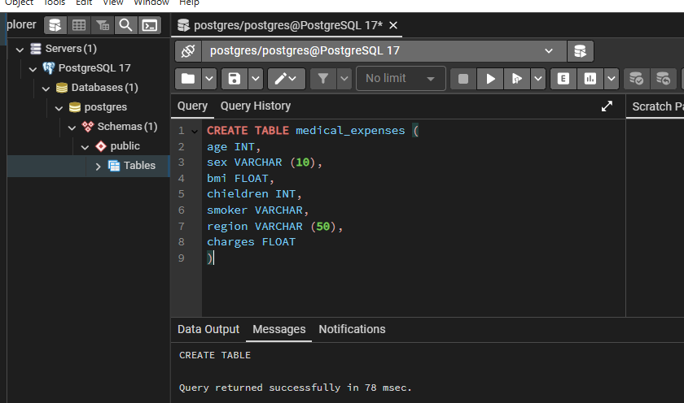

# Natural Language SQL with LangChain, OpenAI & PostgreSQL — Medical Expenses Dataset

## Project Overview

This project enables natural language querying over a structured dataset (medical insurance expenses) by leveraging LangChain, OpenAI, and a local PostgreSQL database. Instead of writing SQL manually, users can ask questions like:  
- “what region has the highest average charges?”

LangChain translates the question to SQL, queries the PostgreSQL database, and returns the result — all from a Jupyter Notebook interface. No backend web server (like FastAPI) is needed for this version.
This is perfect for showcasing how LLMs can bridge the gap between data science and end users in real-world analytics workflows.  

## Tools & Technologies Used

| Tool/Library         | Purpose                                                        |
| -------------------- | -------------------------------------------------------------- |
| **PostgreSQL**       | Local relational database for storing medical expenses         |
| **Pandas**           | Load and manipulate CSV data                                   |
| **SQLAlchemy**       | Interface between Python and PostgreSQL                        |
| **LangChain**        | Translate natural language into SQL                            |
| **OpenAI (GPT-4)**   | Language model that powers the natural language understanding  |
| **dotenv**           | Securely manage API keys and environment variables             |
| **Jupyter Notebook** | Interactive development environment to run the entire pipeline |

## Dataset 
**CSV File: insurance.csv**  
Fields:
- age
- sex
- bmi
- children
- smoker
- region
- charges

## Step-by-Step Workflow

### Step 1: Load Medical Expense Data
- Load insurance.csv into a Pandas DataFrame.
- Columns include: age, sex, bmi, children, smoker, region, and charges.

### Step 2: Store Data in PostgreSQL
- Use SQLAlchemy to connect to your local PostgreSQL database.
- Create a table (medical_expenses) and populate it with the CSV data.  

### Step 3: Configure Your Environment
- Use .env to securely store:
- Configure OpenAI API Key
- Configure PostgreSQL connection URL
- Use python-dotenv to load these variables in your notebook.

### Step 4: Connect LangChain to PostgreSQL
- Set up SQLDatabase object with your PostgreSQL URI.
- Use LangChain's SQLDatabaseChain to combine your database with OpenAI GPT.

### Step 5: Ask Questions in Plain English
- Ask question's about the dataset **(shown in Notebook)**  
-The chain:
- Translates your question to SQL,
- Queries the PostgreSQL DB,
- Returns the answer in plain language.

### Step 6: Interpret Results in Notebook
-LangChain logs:
- The original question
- The generated SQL query
- The result and explanation

### Updated Step-by-Step Workflow (with Interactive Loop)
- Prompts the user to ask a question
- Exits when user types 'exit'
- Sends the question to LangChain + GPT for translation and execution
- Prints the natural language answer
